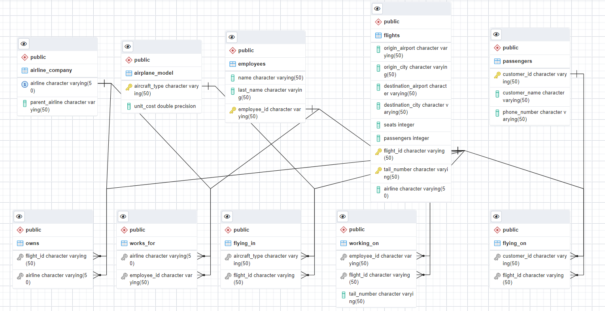

# Airline_Database_Management

Our project is a dummy database that simulates commercial airline data and focuses on building a model to organize optimal solutions to passenger flying patterns and customer flight selection. 

The model can be used to inform a variety of business needs including:
- logistical planning,
- staffing, and
- customer retention/aquisition

With this research project, we hope to enable the airports to better manage their customers, employees, and capital, and provide solutions for streamlining resource utility management. Below, you can see our ER diagram that details the schema of our relational model:

## Steps to Install and Run the Project

1. Download SQL code, and csv table files from main branch and create database in postgreSQL.
2. Create a database in pgAdmin, right click the database and select "Query Tool" to query the database.

## Implementation

We processed data sets from [Kaggle.com](https://www.kaggle.com/), as well as other sources, using Python and imported our data into PGAdmin to build our database. Our build commands can be found in the [create_statements.sql](https://github.com/amishagupta18/Airline_Database_Management/blob/0197a6e94d04f0f4a677464d29f8eb3f6f218afb/Code/create_statements.sql) file under the **Code** directory in our repo and all the datsets that Kaggle would allow us to upload can be found in the **Data** directory. If you wish to review the python code we used to clean and genernate our data, it can be found in the [project_tables.ipynb](https://github.com/amishagupta18/Airline_Database_Management/blob/0197a6e94d04f0f4a677464d29f8eb3f6f218afb/Code/project_tables.ipynb) file under the **Code** directory in the repo. 

Once our primary tables were build, we were sucessfully able to query them:

    

From here, we had two main goals:
1. Testing the datbase to make sure that various queries could be run sucessfully
2. Editing the database for continuity, style and ease of use. 

### Testing the Dataset

In order to test the datset, we ran a variety of sample queries to ensure that tables could be joined and return meaingful results. See some of our sample queries below.

#### Query 1:
This query returns the names of customers, and the originating city of their flights, who flew on planes costing more than $5M, and from a city whose name begins with 'B'.

    SELECT DISTINCT(customer_name), flights.origin_city  
    FROM passengers, flying_on, flights, airplane_model, flying_in  
    WHERE passengers.customer_id = flying_on.customer_id  
      AND flying_on.flight_id = flying_in.flight_id  
      AND flying_in.aircraft_type = airplane_model.aircraft_type  
      AND airplane_model.unit_cost > 5  
      AND flying_on.flight_id = flights.flight_id  
      AND flights.origin_city LIKE 'B%';
Output:  

#### Query 2:
This query returns the first and last name of any employee who worked on an airplane whose tail number is exactly four characters long.

    SELECT employees.name, employees.last_name
    FROM employees, working_on
    WHERE employees.employee_id = working_on.employee_id 
      AND working_on.tail_number LIKE '____'
    GROUP BY employees.employee_id;
Output:  

#### Query 3:
This query returns the departure and destination airports of any flight where a passengers phone number and the flight number end with the same value.

    SELECT origin_airport, destination_airport
    FROM flights, passengers, flying_on
    WHERE flights.flight_id = flying_on.flight_id 
      AND flying_on.customer_id = passengers.customer_id 
      AND RIGHT(passengers.phone_number, 1) = RIGHT(flights.flight_id, 1);
Output:  

#### Query 4:
This query returns the parent airline and the number of flights with 100 or more empty seats.

    SELECT airline_company.parent_airline, COUNT(flights.flight_id) AS missing_100
    FROM flights, airline_company, owns
    WHERE flights.flight_id = owns.flight_id 
      AND owns.airline = airline_company.airline	
      AND flights.seats - flights.passengers >= 100
    GROUP BY airline_company.parent_airline;
Output:  

#### Query 5:
This query returns the airline name and number of flights that traveled through a city whose name contains the letter 'e'. only return those airlines who flew at least ten flights and list them in descending order.

    SELECT flights.airline, COUNT(flights.flight_id) AS counts
    FROM flights
    WHERE flights.destination_city LIKE '%e%' OR flights.origin_city LIKE '%e%'
    GROUP BY flights.airline
    HAVING COUNT(flights.flight_id) >= 10
    ORDER BY counts DESC
Output:  

> *You can find more sample queries under the **Code** directory of our repo.*

Once we were reasonably sure that our database could return useable results, we made some additional stylistic changes to increase it's ease of use, such as insuring that matching cases were use for columns, and that imported headers were deleted where necessary.

##Web UI Installation
1. Apache, PHP, and PostgreSQL server will need to be installed and running (MAPP for mac :) , WAPP for Windows, LAPP for Linux) to provide the connections between web, PHP, and PostgreSQL database (I used MaPP-Stack from Bitnami).
2. Download WEB_UI folder from main branch, and copy files into your Apache htdocs folder in your server. If you want to hold multiple projects on the server, there is another way of saving the project in your computer, which can be found in the respective server documentation, but for the sake of this individual project, putting it in htdocs is simple.
3. All $db_connection variables will need to be reconfigured to your specification and postgres authentication, with the connection pointing towards the airport database locally hosted on your postgreSQL environment .
Open up "http://localhost:8080/index.html" in your web browser.
