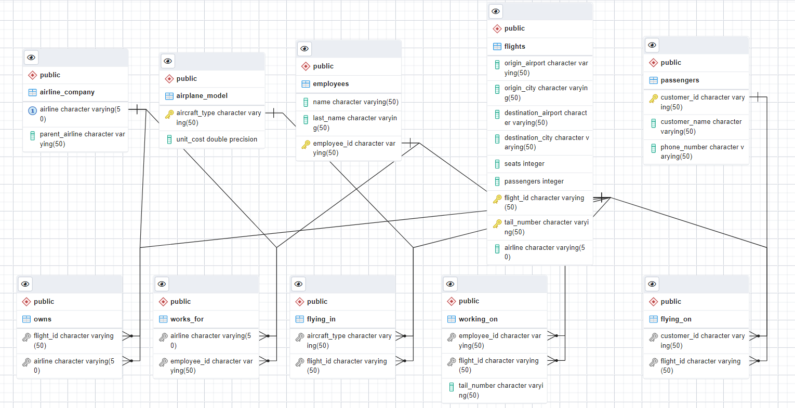

# Airline_Database_Management

Our project is a dummy database that simulates commercial airline data and focuses on building a model to organize optimal solutions to passenger flying patterns and customer flight selection. The model can be used to inform logistical, staffing, and customer needs in order to improve business practices and inform decisions. With this research project, we hope to enable the airports to better manage their customers, employees, and capital, and provide solutions for streamlining resource utility management. Below, you can see our ER diagram that details the schema of our relational model:

Our database was built to provide an airport with information that displays how customers fly, how people choose an airline, as well as the logistics of an airport. The database can be used to track how customers fly by using the airline company, passengers, and flights tables. It can also be utilized to evaluate how people choose an airline, analyzing various metrics such as destinations, origins, and the passenger.

Airports can use this database to manage their own business by looking at the statistics, and implementing possible changes to improve efficiency. The database can also be used to identify an airlines most valuable customers and to analyze trends to bring more passengers in, while retaining existing customers.

